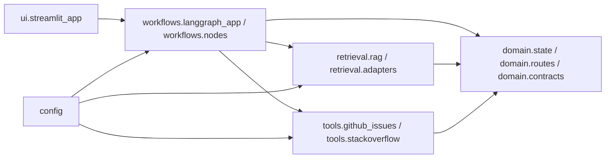

# Architecture Spine — SuppBro

## Design Paradigm

SuppBro uses layered ports-and-adapters: domain contracts define the stable language, workflows orchestrate state transitions, retrieval and external tools implement ports, and Streamlit is a UI adapter over workflow state.



## Invariants & Rules

### AD-1 — Package boundaries use ports-and-adapters [ADOPTED]

- **Binds:** all `src/supp_bro/` product code
- **Prevents:** UI, graph nodes, retrieval, and tools choosing incompatible call shapes or owning parallel workflow models.
- **Rule:** `ui` may call `workflows`; `workflows` may call `domain`, `retrieval`, `tools`, and `config`; `retrieval` and `tools` may return only domain contracts to workflows; lower layers must not import `ui`.

### AD-2 — Domain owns routes, state, and shared contracts [ADOPTED]

- **Binds:** `domain/state.py`, `domain/routes.py`, `domain/contracts.py`, `workflows/*`, `retrieval/*`, `tools/*`, `ui/*`
- **Prevents:** duplicated route literals, provider JSON leaking into graph state, and UI-specific state becoming product state.
- **Rule:** Route names, workflow state fields, tool request/observation shapes, RAG observations, and answer envelopes are defined in `domain`; adapters translate provider payloads before crossing into workflows.

### AD-3 — Workflows are the only orchestration layer [ADOPTED]

- **Binds:** `workflows/langgraph_app.py`, `workflows/nodes.py`
- **Prevents:** retrieval modules, tools, or UI components making route decisions or composing final answers independently.
- **Rule:** Workflow nodes classify, plan, execute retrieval/tool steps, append observations, and compose final answers by mutating one shared workflow state object; retrieval and tools return evidence observations, not product-final answers.

### AD-4 — Traceability is part of the state contract [ADOPTED]

- **Binds:** workflow state, Streamlit trace views, unit tests for routes and transitions
- **Prevents:** demos that answer correctly but cannot explain route, plan, RAG context, tool calls, fallback, or clarification state.
- **Rule:** Every workflow run records route, plan, completed steps, executed nodes, RAG calls, retrieved context, tool calls, external tool results, run outcome, clarification flag, fallback flag, and final answer in the canonical `domain.state.WorkflowState`.

### AD-5 — Configuration owns environment access and secrets [ADOPTED]

- **Binds:** `config.py`, retrieval adapters, external tools, workflow entrypoints
- **Prevents:** scattered environment reads, accidental secret logging, and tests that require live credentials by default.
- **Rule:** Modules receive settings or explicit tokens through typed inputs; `config.py` is the only product module that reads environment variables; never store or print `MONGODB_URI`.

### AD-6 — Workflow state and trace have one canonical representation

- **Binds:** `domain/state.py`, `domain/contracts.py`, `workflows/nodes.py`, `ui/streamlit_app.py`
- **Prevents:** LangGraph nodes, Streamlit trace rendering, and tests each using locally valid but incompatible state or trace shapes.
- **Rule:** `domain.state.WorkflowState` is the only workflow state type; UI reads serialized `TraceView`/state projections from domain contracts; generic event logs may exist internally only if converted to the canonical fields before crossing module boundaries.

### AD-7 — Routes and ports define execution contracts

- **Binds:** `domain/routes.py`, `domain/contracts.py`, `retrieval/*`, `tools/*`, `workflows/*`
- **Prevents:** shared route names with different required steps, adapter-specific request shapes in workflow nodes, and evidence that cannot be cited consistently.
- **Rule:** Each route defines its required plan shape, optional steps, and required observation types; every adapter exposes a port method accepting a domain request contract and returning a domain observation contract with source identity, citation target, snippet, confidence/status, and redacted raw reference.

### AD-8 — Provider availability is capability-scoped

- **Binds:** `config.py`, retrieval adapters, tool adapters, workflow fallback behavior
- **Prevents:** local quick-dev failing at startup without live credentials, provider clients using incompatible timeout/retry behavior, and UI/tests disagreeing about degraded runs.
- **Rule:** Settings validation is capability-scoped; local app startup does not require live provider credentials; missing credentials, timeouts, rate limits, and provider errors become typed observations with a shared run outcome instead of uncaught startup failures.

### AD-9 — First product slice establishes import contract

- **Binds:** first `src/supp_bro/` implementation slice, `tests/unit/`, Streamlit entrypoint
- **Prevents:** one slice using package imports while another relies on script-directory `sys.path` mutation.
- **Rule:** The first product package slice must establish the local import/install contract for tests and Streamlit startup; no product module may rely on homework-style path mutation.

## Consistency Conventions

| Concern | Convention |
| --- | --- |
| Routes | Product route names are `docs_answer`, `issue_investigation`, `community_lookup`, and `clarification`. |
| State mutation | Workflow nodes mutate/return one domain workflow state and append observations instead of replacing trace history. |
| Provider data | Any provider payload used by an adapter is normalized before entering workflow state; current brownfield examples are GitHub, Stack Overflow, Pinecone, OpenAI, MongoDB/PyMongo, FAISS, sentence-transformers, and BM25 inputs. |
| Fallbacks | Retrieval fallback, tool failure, and clarification are explicit state outcomes, not exceptions hidden from the UI. |
| Tests | Unit tests assert route selection, contract validation, state transitions, fallback behavior, and adapter normalization. |
| Contract tests | Port contracts use shared fixtures so producer and consumer tests validate the same request/observation shapes. |

## Stack

| Name | Version |
| --- | --- |
| Python | 3.11 repo baseline |
| LangGraph | `>=1.0.0` |
| Streamlit | `>=1.37.0` |
| OpenAI Python SDK | `>=1.80.0` |
| Pinecone Python SDK | `>=7.0.0` |
| PyMongo | `>=4.7.0` brownfield input |
| FAISS CPU | `1.8.0.post1` brownfield input |
| sentence-transformers | `3.0.1` brownfield input |
| rank-bm25 | `0.2.2` brownfield input |
| python-dotenv | `1.0.1` brownfield input |
| tiktoken | `0.7.0` brownfield input |

## Structural Seed

```text
src/
  supp_bro/
    __init__.py
    config.py
    domain/
      state.py
      routes.py
      contracts.py
    retrieval/
      rag.py
      adapters.py
    tools/
      github_issues.py
      stackoverflow.py
    workflows/
      langgraph_app.py
      nodes.py
    ui/
      streamlit_app.py

tests/
  unit/
```

## Capability → Architecture Map

| Capability / Area | Lives in | Governed by |
| --- | --- | --- |
| Debezium documentation answers | `retrieval/rag.py`, `workflows/nodes.py` | AD-1, AD-2, AD-3, AD-4 |
| Known issue investigation | `retrieval/rag.py`, `tools/github_issues.py`, `workflows/nodes.py` | AD-1, AD-2, AD-3, AD-5 |
| Community lookup | `tools/stackoverflow.py`, `workflows/nodes.py` | AD-1, AD-2, AD-3 |
| Clarifying questions | `domain/routes.py`, `workflows/nodes.py` | AD-2, AD-3, AD-4 |
| Streamlit demo trace | `ui/streamlit_app.py` | AD-1, AD-4 |
| Provider degraded mode | `config.py`, adapters, `workflows/nodes.py` | AD-5, AD-8 |

## Deferred

- Deployment, hosting, and production persistence are deferred; current scope is local quick-dev and Streamlit demo behavior.
- Retrieval backend consolidation is deferred; first product slices should wrap current HW4/HW3 behavior behind contracts before choosing a long-term backend.
- Exact prompt strategy and model choice are deferred to retrieval implementation slices; this spine only binds output contracts and fallback semantics.
