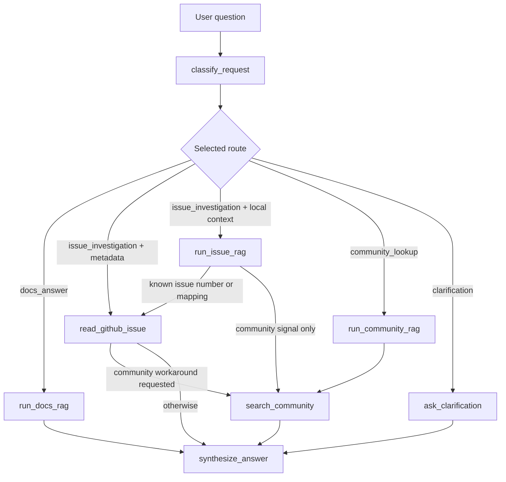

# Final project: route-aware SuppBro workflow

Ця папка містить final project workflow. Він базується на HW7 `LangGraph` implementation, але лежить окремо від homework-папок і додає головне final-project покращення: workflow спочатку збирає evidence з local RAG, GitHub і Stack Overflow/community, а потім окремий `synthesize_answer` step може викликати модель для фінальної відповіді.

## Як Запускати

Одне питання:

```bash
python scripts/final/langgraph_flow.py \
  "What should I do if Debezium MongoDB says unable to acquire buffer lock?" \
  --allow-external-community-search \
  --output-json final-langgraph-result.json \
  --output-md final-langgraph-summary.md
```

Demo на п'яти питаннях:

```bash
python scripts/final/langgraph_flow.py \
  --mode demo \
  --output-json final-langgraph-result.json \
  --output-md outputs/final_langgraph_examples.md
```

Запуск без HW4 credentials:

```bash
python scripts/final/langgraph_flow.py \
  --mode demo \
  --disable-rag \
  --output-md outputs/final_langgraph_examples.md
```

Streamlit demo:

```bash
make final-streamlit
```

GitHub Actions demo:

```text
Actions -> Run Final LangGraph Workflow -> Run workflow
```

## Demo Cases

Built-in demo mode проганяє п'ять questions, які показують різні гілки workflow:

| # | Question | Що показує |
|---:|---|---|
| 1 | `Can I get exactly once delivery with Debezium?` | `docs_answer`: documentation RAG. |
| 2 | `Explain the known Debezium MongoDB buffer lock problem from the local context.` | `issue_investigation`: local issue RAG + GitHub tool. |
| 3 | `What should I do if Debezium MongoDB says unable to acquire buffer lock?` | Main final improvement: local RAG + GitHub tool + community check + final synthesis. |
| 4 | `Debezium Mysql Connector Failed with IllegalStateException for history topic` | `issue_investigation`: troubleshooting question + local issue RAG + clean Stack Overflow query. |
| 5 | `Help with Debezium` | `clarification`: уточнення замість випадкового RAG. |

## Routes

| Route | Для чого |
|---|---|
| `docs_answer` | Відповісти на documentation-style question через local RAG. |
| `issue_investigation` | Розібрати known issue через local issue context і/або live GitHub metadata. |
| `community_lookup` | Підтримується для explicitly community-only questions, але final demo показує реалістичніший шлях: community search як додатковий крок після issue investigation. |
| `clarification` | Поставити уточнюючі питання, якщо request занадто нечіткий. |

## Workflow Graph



Ключова final-project гілка тут: `synthesize_answer`. RAG і tools тепер не намагаються самі бути фінальною відповіддю. Вони збирають evidence, а фінальний step формує support answer з урахуванням local context, project metadata і community hints.

Друга важлива гілка: `issue_investigation + community signal`. Якщо користувач питає про troubleshooting error, workflow спочатку дивиться local issue context. Якщо питання має конкретний issue number або відому локальну евристику, workflow також додає GitHub metadata. Після цього він може додати Stack Overflow/community signal.

Для Stack Overflow workflow будує окремий clean technical query. Routing може спрацювати від слів типу `failed`, `IllegalStateException`, `history topic`, `workaround` або `community`, але у Stack Overflow search не треба додавати службові routing-слова. Наприклад:

```text
User question: Debezium Mysql Connector Failed with IllegalStateException for history topic
Stack query:   Debezium Mysql Connector Failed with IllegalStateException for history topic
```

А якщо користувач пише `How to fix ... Include possible community workarounds`, search query очищається до технічної частини:

```text
Stack query: Debezium MongoDB buffer lock
```

## Як Тут Працює RAG

Final workflow повторно використовує HW4 RAG pipeline для documentation answers і issue explanations. Простими словами, RAG означає: спочатку знайти релевантний local context, а потім попросити LLM відповісти тільки з цього context.

```text
question
  -> retrieve candidate chunks
  -> filter weak retrieval results
  -> build prompt with retrieved context
  -> ask LLM for JSON answer with citations
  -> validate answer and citations
```

Retrieval комбінує два search signals:

| Signal | Для чого корисний | Приклад |
|---|---|---|
| Dense vector search | Знаходить семантично схожі chunks навіть тоді, коли wording інший. | `exactly once delivery` може знайти docs про delivery guarantees. |
| BM25 keyword search | Знаходить точні technical terms і error phrases. | `buffer lock`, `queue is full`, `backpressure`. |

Dense vector search корисний, бо користувач не завжди формулює питання тими самими словами, які є в documentation. BM25 корисний, бо technical support часто залежить від точних рядків із logs, exceptions, config names або issue titles.

### Що Зберігається В Pinecone

У Pinecone зберігаються vector representations для chunks. Кожен chunk має:

- `id`, щоб потім повернути конкретний fragment;
- `values`, тобто embedding vector;
- `metadata`, щоб знати source, file, chunk text або інші поля для filtering.

Спрощена структура Pinecone record:

```json
{
  "id": "pages:configuration/storage.adoc:chunk-3",
  "values": [0.012, -0.034, 0.087],
  "metadata": {
    "source": "pages",
    "source_file": "configuration/storage.adoc",
    "chunk_id": "pages:configuration/storage.adoc:chunk-3",
    "text": "Debezium stores offsets and schema history..."
  }
}
```

Для issue chunk структура може бути схожа:

```json
{
  "id": "issues:debezium-project-5:issue-3:chunk-1",
  "values": [0.044, 0.018, -0.025],
  "metadata": {
    "source": "issues",
    "source_file": "debezium-project-5.jsonl",
    "chunk_id": "issues:debezium-project-5:issue-3:chunk-1",
    "text": "mongodb : Unable to acquire buffer lock, buffer queue is likely full..."
  }
}
```

Коли workflow запускає RAG, він передає query у retrieval layer. Для documentation route використовується metadata filter:

```json
{
  "source": {
    "$eq": "pages"
  }
}
```

Для issue route використовується:

```json
{
  "source": {
    "$eq": "issues"
  }
}
```

Приклад query для Pinecone dense search:

```text
Question: "What does unable to acquire buffer lock mean in Debezium?"
Filter:   source = issues
Top K:    candidate chunks
```

Pinecone повертає найближчі chunks разом із `vector_score`. Чим вищий `vector_score`, тим ближче embedding query до embedding chunk-а. Але сам `vector_score` ще не гарантує, що chunk достатній для grounded answer. Він тільки показує semantic similarity.

### BM25 Простими Словами

BM25 це classic keyword ranking algorithm. Він дає chunk-у вищий score, якщо:

- query words зустрічаються в цьому chunk;
- rare words збігаються, бо вони зазвичай більш інформативні;
- chunk не виграє тільки тому, що він дуже довгий.

Для query:

```text
unable to acquire buffer lock queue is full
```

BM25 сильно піднімає chunks, де є exact phrases типу `buffer lock` або `queue is full`.

### RRF Простими Словами

RRF означає `Reciprocal Rank Fusion`. Він об'єднує dense vector ranking і BM25 ranking, не намагаючись прямо порівнювати їхні raw scores.

Ідея така:

```text
якщо chunk високо в одному зі списків,
він отримує points;
якщо chunk високо в обох списках,
він отримує ще більше points.
```

Спрощена formula:

```text
RRF score = 1 / (k + dense_rank) + 1 / (k + bm25_rank)
```

де `k` це smoothing constant, який не дає rank 1 занадто сильно домінувати над усіма іншими.

Приклад:

| Chunk | Dense rank | BM25 rank | Чому може виграти |
|---|---:|---:|---|
| A | 1 | 8 | Дуже близький semantic match. |
| B | 6 | 1 | Має exact error terms. |
| C | 3 | 3 | Добрий в обох rankings, часто найкращий balanced result. |

Це корисно для SuppBro, бо Debezium support questions можуть бути і semantic, і keyword-heavy. Користувач може спитати широке conceptual question або вставити точну error phrase. Hybrid retrieval дає workflow більший шанс знайти корисний context в обох випадках.

`min_vector_score` це pre-LLM guardrail. Якщо найкращий vector match нижчий за threshold, workflow може зупинитися до виклику model і повернути retrieval fallback. Якщо retrieval пройшов, але LLM все одно каже, що context недостатній, post-validator записує model fallback, наприклад `llm_reports_insufficient_context`.

## Final Improvement

### Weak Point Before

До final step workflow збирав correct evidence, але фінальна відповідь була просто Python string assembly.

Наприклад для troubleshooting question:

```text
Question: What should I do if Debezium MongoDB says unable to acquire buffer lock?
Before:   classify_request -> run_issue_rag -> read_github_issue -> search_community -> build_answer
Answer:   Local RAG sentence + GitHub metadata sentence + Stack Overflow sentence
```

Це корисно для trace, але не дуже схоже на реального support assistant-а. Він не аналізував разом local context, GitHub state і community workaround-и. Він просто додавав їх один за одним.

### Improvement After

Final workflow тепер має окремий synthesis step:

```text
Question: What should I do if Debezium MongoDB says unable to acquire buffer lock?
After:    classify_request -> run_issue_rag -> read_github_issue -> search_community -> synthesize_answer
```

Тобто модель може викликатися двічі:

| Model call | Де | Для чого |
|---|---|---|
| 1 | `run_issue_rag` або `run_docs_rag` | Відповісти тільки з local retrieved context або чесно сказати, що context недостатній. |
| 2 | `synthesize_answer` | Зібрати фінальну support answer з RAG result, GitHub metadata і Stack Overflow/community results. |

`synthesize_answer` отримує structured evidence:

```json
{
  "user_question": "...",
  "selected_route": "issue_investigation",
  "route_reason": "...",
  "rag_calls": ["local RAG observations"],
  "tool_results": ["GitHub and Stack Overflow observations"]
}
```

Prompt просить модель:

- відповідати тільки з provided evidence;
- відділяти local/project evidence від GitHub metadata і community hints;
- позначати workaround як community workaround, якщо він прийшов тільки зі Stack Overflow;
- чесно сказати, якщо evidence недостатній;
- включати релевантні URLs з observations.

Якщо `OPENAI_API_KEY` недоступний або model call падає, workflow не ламається: він fallback-иться до попередньої deterministic answer assembly. Це потрібно, щоб demo mode і GitHub Actions могли працювати без live model credentials.

### Realistic Demo Questions

Final demo більше не робить центральним artificial issue metadata question, бо реальні користувачі частіше описують symptom або error. Замість цього воно показує support-style questions:

```text
What should I do if Debezium MongoDB says unable to acquire buffer lock?
Debezium Mysql Connector Failed with IllegalStateException for history topic
```

Перший case має known local mapping на GitHub issue і може пройти:

```text
classify_request -> run_issue_rag -> read_github_issue -> search_community -> synthesize_answer
```

Другий case не має exact GitHub issue number/mapping, тому не викликає зайвий GitHub clarification tool і йде так:

```text
classify_request -> run_issue_rag -> search_community -> synthesize_answer
```

### Remaining Limitations

Intent detection у final workflow поки що deterministic: це набір правил і keywords, а не окрема модель. Це добре для demo, бо route легко пояснити й повторити, але воно не ідеальне для живого bot-а.

Приклад питання, яке може заплутати router:

```text
It worked yesterday, but after restart it cannot recover its internal state
```

Тут людина може описувати Debezium schema/history recovery problem, але немає явних слів `Debezium`, `schema history`, `topic`, `exception` або `failed`, тому deterministic router може піти в clarification або documentation route замість troubleshooting investigation.

Також final workflow не має persistent memory або conversation state. Він не пам'ятає active issue/topic між репліками й не може сам розкрити посилання на попередній контекст.

```text
Does this issue have a workaround now?
```

Тут правильна відповідь залежить від того, що означає `this issue`: який connector, який error або який issue number обговорювався раніше. Поточний workflow має попросити уточнення, бо не зберігає таку пам'ять.

## Verification

Запуск focused tests:

```bash
python -m unittest scripts/final/test_langgraph_flow.py
```

Запуск final demo без external RAG credentials:

```bash
python scripts/final/langgraph_flow.py --mode demo --disable-rag
```

Known issue with community workaround case має показати:

```text
classify_request -> run_issue_rag -> read_github_issue -> search_community -> synthesize_answer
```

Troubleshooting Stack Overflow case має показати:

```text
classify_request -> run_issue_rag -> search_community -> synthesize_answer
```
