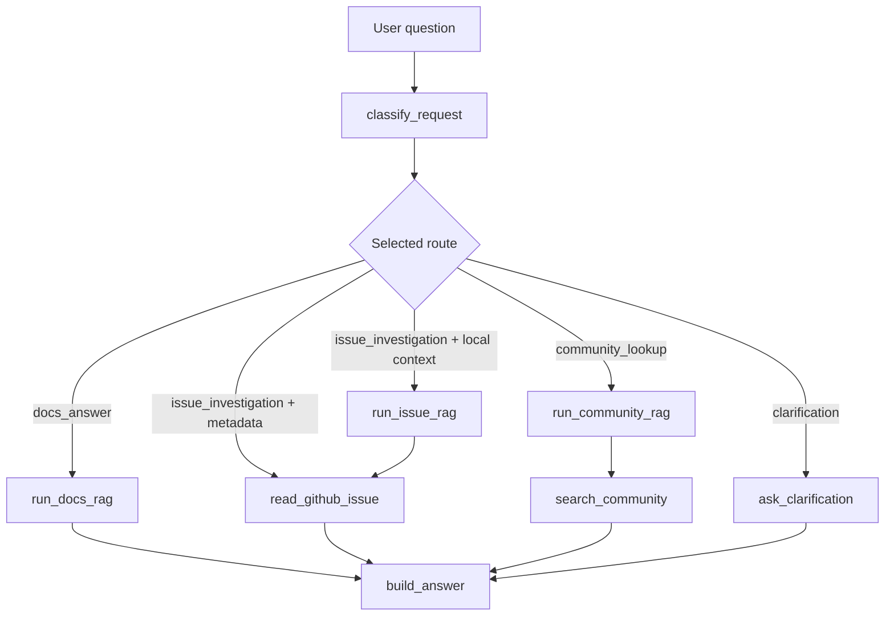

# Final project: route-aware SuppBro workflow

This folder contains the final project workflow. It is based on the HW7 LangGraph implementation, but lives separately from the homework folders and adds one focused improvement: explicit GitHub issue metadata questions skip local issue RAG and go directly to the GitHub issue tool.

## How to run

Single question:

```bash
python scripts/final/langgraph_flow.py \
  "Is Debezium issue #3 still open and who worked on it?" \
  --issue-number 3 \
  --output-json final-langgraph-result.json \
  --output-md final-langgraph-summary.md
```

Demo on five questions:

```bash
python scripts/final/langgraph_flow.py \
  --mode demo \
  --output-json final-langgraph-result.json \
  --output-md outputs/final_langgraph_examples.md
```

Run without HW4 credentials:

```bash
python scripts/final/langgraph_flow.py \
  --mode demo \
  --disable-rag \
  --output-md outputs/final_langgraph_examples.md
```

Streamlit demo:

```bash
make final-streamlit
```

## Routes

| Route | Purpose |
|---|---|
| `docs_answer` | Answer documentation-style questions using local RAG. |
| `issue_investigation` | Investigate known issues using local issue context and/or live GitHub metadata. |
| `community_lookup` | Search Stack Overflow/community sources for explicitly community-oriented questions. |
| `clarification` | Ask follow-up questions when the request is too vague. |

## Workflow Graph



The important final-project branch is `issue_investigation + metadata`: when the user asks about a concrete issue number and live metadata, the graph skips `run_issue_rag` and calls GitHub directly.

## How RAG Works Here

The final workflow reuses the HW4 RAG pipeline for documentation answers and issue explanations. In simple terms, RAG means: first find relevant local context, then ask the LLM to answer only from that context.

```text
question
  -> retrieve candidate chunks
  -> filter weak retrieval results
  -> build prompt with retrieved context
  -> ask LLM for JSON answer with citations
  -> validate answer and citations
```

The retrieval part combines two different search signals:

| Signal | What it is good at | Example |
|---|---|---|
| Dense vector search | Finds semantically similar chunks even when wording is different. | `exactly once delivery` can match docs that discuss delivery guarantees. |
| BM25 keyword search | Finds exact technical terms and error phrases. | `buffer lock`, `queue is full`, `backpressure`. |

Dense vector search is useful because users do not always use the same words as the documentation. BM25 is useful because technical support often depends on exact strings from logs, exceptions, config names, or issue titles.

### BM25 in simple terms

BM25 is a classic keyword ranking algorithm. It scores a chunk higher when:

- the query words appear in that chunk;
- rare words match, because rare words are usually more informative;
- the chunk is not only matching because it is very long.

So for a query like:

```text
unable to acquire buffer lock queue is full
```

BM25 strongly rewards chunks that contain exact phrases such as `buffer lock` or `queue is full`.

### RRF in simple terms

RRF means Reciprocal Rank Fusion. It merges the dense vector ranking and the BM25 ranking without trying to compare their raw scores directly.

The idea is:

```text
if a chunk is near the top in either search result list,
give it points;
if it is near the top in both lists,
give it even more points.
```

The simplified formula is:

```text
RRF score = 1 / (k + dense_rank) + 1 / (k + bm25_rank)
```

where `k` is a smoothing constant that prevents rank 1 from completely dominating everything else.

Example:

| Chunk | Dense rank | BM25 rank | Why it can win |
|---|---:|---:|---|
| A | 1 | 8 | Very semantically close. |
| B | 6 | 1 | Contains exact error terms. |
| C | 3 | 3 | Good in both rankings, often the best balanced result. |

This is useful for SuppBro because Debezium support questions can be both semantic and keyword-heavy. A user may ask a broad conceptual question, or paste a precise error phrase. Hybrid retrieval gives the workflow a better chance to find useful context in both cases.

The `min_vector_score` setting is a pre-LLM guardrail. If the best vector match is below the threshold, the workflow can stop before calling the model and return a retrieval fallback. If retrieval passes but the LLM still says the context is insufficient, the post-validator records a model fallback such as `llm_reports_insufficient_context`.

## Final improvement

### Weak point before

The HW7 workflow correctly routed explicit GitHub issue questions to `issue_investigation`, but it always ran local issue RAG before calling the GitHub tool.

For example:

```text
Question: Is Debezium issue #3 still open and who worked on it?
Before:   classify_request -> run_issue_rag -> read_github_issue -> build_answer
RAG:      model_fallback
Tool:     get_github_issue_context success
```

This was functional, but not ideal. The question asks for live issue metadata: state, assignees, labels, participants, comments, updated date, and URL. Local RAG is not the best source for that data because it can be stale or incomplete. Running it first added an expected fallback to the trace and made the workflow look noisier than necessary.

### Improvement after

The final workflow detects explicit GitHub issue metadata questions and skips local issue RAG for that branch.

```text
Question: Is Debezium issue #3 still open and who worked on it?
After:    classify_request -> read_github_issue -> build_answer
RAG:      not_called
Tool:     get_github_issue_context success
```

The workflow still uses RAG for issue-like error questions that need local context before checking a related GitHub issue.

```text
Question: Backpressure error says unable to acquire buffer lock and queue is full
After:    classify_request -> run_issue_rag -> read_github_issue -> build_answer
RAG:      called
Tool:     get_github_issue_context success
```

### Detection rule

The workflow skips issue RAG only when both are true:

- the user provides an explicit issue number, either in the question or through `--issue-number`;
- the question asks for live metadata such as status, open/closed state, assignees, labels, participants, comments, updates, or who worked on the issue.

This keeps the improvement narrow: exact issue metadata goes directly to the live tool, while broader issue investigation can still combine local RAG context with GitHub metadata.

## Verification

Run the focused tests:

```bash
python -m unittest scripts/final/test_langgraph_flow.py
```

Run the final demo without external RAG credentials:

```bash
python scripts/final/langgraph_flow.py --mode demo --disable-rag
```

The explicit issue metadata case should show:

```text
classify_request -> read_github_issue -> build_answer
RAG status: not_called
```