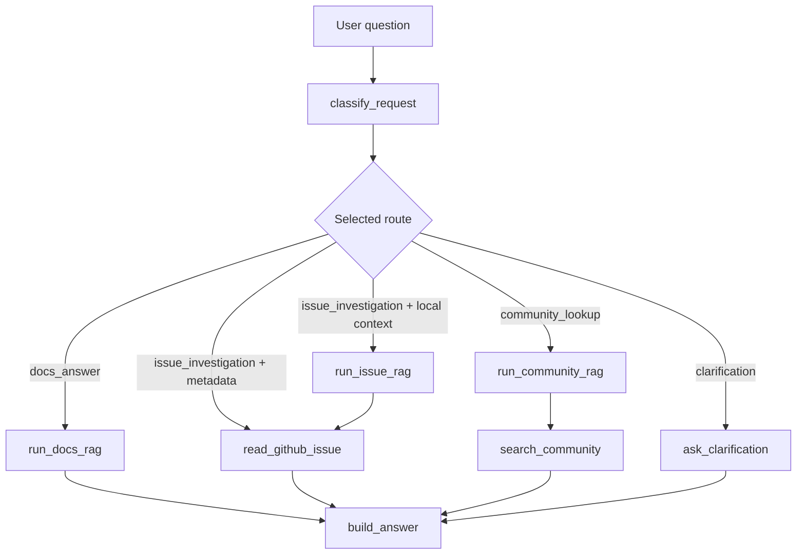

# Final project: route-aware SuppBro workflow

Ця папка містить final project workflow. Він базується на HW7 `LangGraph` implementation, але лежить окремо від homework-папок і додає одне точкове покращення: explicit GitHub issue metadata questions пропускають local issue RAG і йдуть прямо в GitHub tool.

## Як Запускати

Одне питання:

```bash
python scripts/final/langgraph_flow.py \
  "Is Debezium issue #3 still open and who worked on it?" \
  --issue-number 3 \
  --output-json final-langgraph-result.json \
  --output-md final-langgraph-summary.md
```

Demo на п'яти питаннях:

```bash
python scripts/final/langgraph_flow.py \
  --mode demo \
  --output-json final-langgraph-result.json \
  --output-md outputs/final_langgraph_examples.md
```

Запуск без HW4 credentials:

```bash
python scripts/final/langgraph_flow.py \
  --mode demo \
  --disable-rag \
  --output-md outputs/final_langgraph_examples.md
```

Streamlit demo:

```bash
make final-streamlit
```

GitHub Actions demo:

```text
Actions -> Run Final LangGraph Workflow -> Run workflow
```

## Demo Cases

Built-in demo mode проганяє п'ять questions, які показують різні гілки workflow:

| # | Question | Що показує |
|---:|---|---|
| 1 | `Can I get exactly once delivery with Debezium?` | `docs_answer`: documentation RAG. |
| 2 | `Explain the known Debezium MongoDB buffer lock problem from the local context.` | `issue_investigation`: local issue RAG + GitHub tool. |
| 3 | `Is Debezium issue #3 still open and who worked on it?` | Final improvement: skip RAG і direct GitHub tool. |
| 4 | `Has anyone seen Debezium unable to acquire buffer lock on Stack Overflow?` | `community_lookup`: local context + Stack Overflow search. |
| 5 | `Help with Debezium` | `clarification`: уточнення замість випадкового RAG. |

## Routes

| Route | Для чого |
|---|---|
| `docs_answer` | Відповісти на documentation-style question через local RAG. |
| `issue_investigation` | Розібрати known issue через local issue context і/або live GitHub metadata. |
| `community_lookup` | Шукати Stack Overflow/community sources для explicitly community-oriented questions. |
| `clarification` | Поставити уточнюючі питання, якщо request занадто нечіткий. |

## Workflow Graph



Ключова final-project гілка тут: `issue_investigation + metadata`. Якщо користувач питає про конкретний issue number і live metadata, workflow пропускає `run_issue_rag` і одразу викликає GitHub tool.

## Як Тут Працює RAG

Final workflow повторно використовує HW4 RAG pipeline для documentation answers і issue explanations. Простими словами, RAG означає: спочатку знайти релевантний local context, а потім попросити LLM відповісти тільки з цього context.

```text
question
  -> retrieve candidate chunks
  -> filter weak retrieval results
  -> build prompt with retrieved context
  -> ask LLM for JSON answer with citations
  -> validate answer and citations
```

Retrieval комбінує два search signals:

| Signal | Для чого корисний | Приклад |
|---|---|---|
| Dense vector search | Знаходить семантично схожі chunks навіть тоді, коли wording інший. | `exactly once delivery` може знайти docs про delivery guarantees. |
| BM25 keyword search | Знаходить точні technical terms і error phrases. | `buffer lock`, `queue is full`, `backpressure`. |

Dense vector search корисний, бо користувач не завжди формулює питання тими самими словами, які є в documentation. BM25 корисний, бо technical support часто залежить від точних рядків із logs, exceptions, config names або issue titles.

### Що Зберігається В Pinecone

У Pinecone зберігаються vector representations для chunks. Кожен chunk має:

- `id`, щоб потім повернути конкретний fragment;
- `values`, тобто embedding vector;
- `metadata`, щоб знати source, file, chunk text або інші поля для filtering.

Спрощена структура Pinecone record:

```json
{
  "id": "pages:configuration/storage.adoc:chunk-3",
  "values": [0.012, -0.034, 0.087],
  "metadata": {
    "source": "pages",
    "source_file": "configuration/storage.adoc",
    "chunk_id": "pages:configuration/storage.adoc:chunk-3",
    "text": "Debezium stores offsets and schema history..."
  }
}
```

Для issue chunk структура може бути схожа:

```json
{
  "id": "issues:debezium-project-5:issue-3:chunk-1",
  "values": [0.044, 0.018, -0.025],
  "metadata": {
    "source": "issues",
    "source_file": "debezium-project-5.jsonl",
    "chunk_id": "issues:debezium-project-5:issue-3:chunk-1",
    "text": "mongodb : Unable to acquire buffer lock, buffer queue is likely full..."
  }
}
```

Коли workflow запускає RAG, він передає query у retrieval layer. Для documentation route використовується metadata filter:

```json
{
  "source": {
    "$eq": "pages"
  }
}
```

Для issue route використовується:

```json
{
  "source": {
    "$eq": "issues"
  }
}
```

Приклад query для Pinecone dense search:

```text
Question: "What does unable to acquire buffer lock mean in Debezium?"
Filter:   source = issues
Top K:    candidate chunks
```

Pinecone повертає найближчі chunks разом із `vector_score`. Чим вищий `vector_score`, тим ближче embedding query до embedding chunk-а. Але сам `vector_score` ще не гарантує, що chunk достатній для grounded answer. Він тільки показує semantic similarity.

### BM25 Простими Словами

BM25 це classic keyword ranking algorithm. Він дає chunk-у вищий score, якщо:

- query words зустрічаються в цьому chunk;
- rare words збігаються, бо вони зазвичай більш інформативні;
- chunk не виграє тільки тому, що він дуже довгий.

Для query:

```text
unable to acquire buffer lock queue is full
```

BM25 сильно піднімає chunks, де є exact phrases типу `buffer lock` або `queue is full`.

### RRF Простими Словами

RRF означає `Reciprocal Rank Fusion`. Він об'єднує dense vector ranking і BM25 ranking, не намагаючись прямо порівнювати їхні raw scores.

Ідея така:

```text
якщо chunk високо в одному зі списків,
він отримує points;
якщо chunk високо в обох списках,
він отримує ще більше points.
```

Спрощена formula:

```text
RRF score = 1 / (k + dense_rank) + 1 / (k + bm25_rank)
```

де `k` це smoothing constant, який не дає rank 1 занадто сильно домінувати над усіма іншими.

Приклад:

| Chunk | Dense rank | BM25 rank | Чому може виграти |
|---|---:|---:|---|
| A | 1 | 8 | Дуже близький semantic match. |
| B | 6 | 1 | Має exact error terms. |
| C | 3 | 3 | Добрий в обох rankings, часто найкращий balanced result. |

Це корисно для SuppBro, бо Debezium support questions можуть бути і semantic, і keyword-heavy. Користувач може спитати широке conceptual question або вставити точну error phrase. Hybrid retrieval дає workflow більший шанс знайти корисний context в обох випадках.

`min_vector_score` це pre-LLM guardrail. Якщо найкращий vector match нижчий за threshold, workflow може зупинитися до виклику model і повернути retrieval fallback. Якщо retrieval пройшов, але LLM все одно каже, що context недостатній, post-validator записує model fallback, наприклад `llm_reports_insufficient_context`.

## Final Improvement

### Weak Point Before

HW7 workflow правильно route-ив explicit GitHub issue questions у `issue_investigation`, але завжди запускав local issue RAG перед GitHub tool.

Наприклад:

```text
Question: Is Debezium issue #3 still open and who worked on it?
Before:   classify_request -> run_issue_rag -> read_github_issue -> build_answer
RAG:      model_fallback
Tool:     get_github_issue_context success
```

Це працювало, але не ідеально. Питання просить live issue metadata: state, assignees, labels, participants, comments, updated date і URL. Local RAG не є найкращим джерелом для таких даних, бо він може бути stale або incomplete. Запуск RAG перед GitHub tool додавав очікуваний fallback у trace і робив workflow шумнішим.

### Improvement After

Final workflow визначає explicit GitHub issue metadata questions і пропускає local issue RAG для цієї гілки.

```text
Question: Is Debezium issue #3 still open and who worked on it?
After:    classify_request -> read_github_issue -> build_answer
RAG:      not_called
Tool:     get_github_issue_context success
```

Workflow все ще використовує RAG для issue-like error questions, де потрібен local context перед перевіркою related GitHub issue.

```text
Question: Backpressure error says unable to acquire buffer lock and queue is full
After:    classify_request -> run_issue_rag -> read_github_issue -> build_answer
RAG:      called
Tool:     get_github_issue_context success
```

### Detection Rule

Workflow пропускає issue RAG тільки коли одночасно виконуються дві умови:

- користувач дає explicit issue number у question або через `--issue-number`;
- question питає про live metadata: status, open/closed state, assignees, labels, participants, comments, updates або who worked on the issue.

Це тримає improvement вузьким: exact issue metadata йде прямо в live tool, а broader issue investigation все ще може комбінувати local RAG context із GitHub metadata.

## Verification

Запуск focused tests:

```bash
python -m unittest scripts/final/test_langgraph_flow.py
```

Запуск final demo без external RAG credentials:

```bash
python scripts/final/langgraph_flow.py --mode demo --disable-rag
```

Explicit issue metadata case має показати:

```text
classify_request -> read_github_issue -> build_answer
RAG status: not_called
```