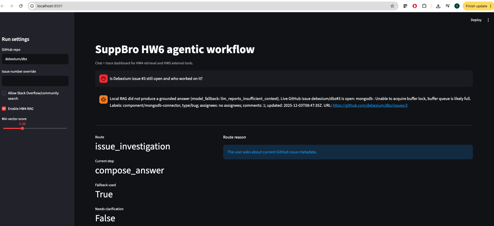
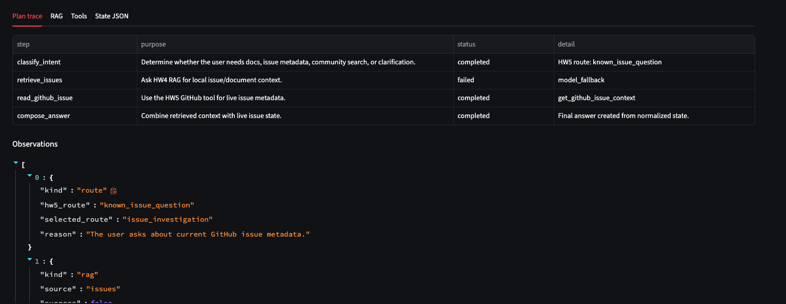
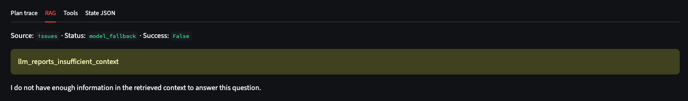
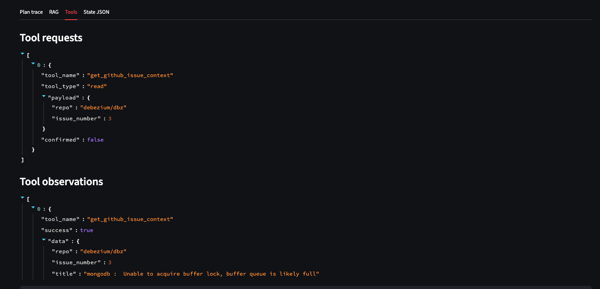

# HW6: agentic workflow для SuppBro

У цьому завданні я беру готовий retrieval з HW4 і external tools з HW5 та додаю над ними контрольований agentic workflow. Тобто бот не просто одразу відповідає, а проходить зрозумілий ланцюжок: визначає намір користувача, вибирає route, будує план, виконує потрібні кроки, записує observations у state і тільки після цього формує фінальну відповідь.

Для демонстрації я додав два способи запуску:

- CLI/GitHub Actions demo, щоб стабільно прогнати 3-5 прикладів і отримати JSON/Markdown trace.
- Streamlit chat, щоб показати фінального бота з дашбордом поточного стану, плану, RAG результатів і external tool calls.

## Workflow schema

```text
user goal
  → classify intent
  → select route
  → build deterministic plan
  → run HW4 retrieval and/or HW5 tool
  → save observation
  → update state
  → compose final answer
```

State містить поля, які потрібні для прозорого agentic workflow:

| Field | Для чого |
|---|---|
| `user_goal` | Початкове питання користувача. |
| `selected_route` | Обраний route: docs, issue, community або clarification. |
| `route_reason` | Пояснення, чому router вибрав саме цей route. |
| `plan` | Список контрольованих кроків зі статусами `pending`, `completed`, `failed`, `skipped`. |
| `current_step` | Останній активний крок. |
| `completed_steps` | Кроки, які вже виконались. |
| `rag_calls` | Результати HW4 retrieval: status, citations, fallback reason, retrieved chunks. |
| `tool_calls` | Запити до HW5 tools у normalized JSON форматі. |
| `external_tool_results` | Observations із GitHub або Stack Overflow tools. |
| `observations` | Єдина timeline-стрічка route/RAG/tool observations. |
| `requires_clarification` | Чи треба перепитати користувача. |
| `fallback_used` | Чи workflow був змушений перейти в fallback. |
| `final_answer` | Відповідь, побудована з поточного state. |

## Routes

| Route | Коли вибирається | Кроки |
|---|---|---|
| `docs_answer` | Користувач питає щось, що схоже на документацію Debezium. | `classify_intent → retrieve_docs → compose_answer` |
| `issue_investigation` | Питання про GitHub issue, статус bug, known error або конкретний stack trace. | `classify_intent → retrieve_issues → read_github_issue → compose_answer` |
| `community_lookup` | Користувач явно просить Stack Overflow/community workaround. | `classify_intent → retrieve_issues → search_community → compose_answer` |
| `clarification` | Запит занадто нечіткий або користувач хоче зарепортати issue без деталей. | `classify_intent → ask_clarifying_question → compose_answer` |

Routing rule-based і deterministic. Для цього HW6 переюзає HW5 `classify_support_intent`, а потім мапить HW5 route у вищорівневий HW6 route.

## Tools

### HW4 RAG retrieval

Тип: local retrieval/generation subprocess.

Коли викликати:

- `docs_answer`: шукати відповідь у documentation pages.
- `issue_investigation`: шукати локальний issue context.
- `community_lookup`: спочатку перевірити локальний context, щоб community search не був єдиним джерелом.

Input приклад:

```json
{
  "question": "Can I get exactly once delivery?",
  "source": "pages",
  "prompt_flavor": "strong",
  "post_validator": "on",
  "min_vector_score": 0.3
}
```

Output приклад:

```json
{
  "source": "pages",
  "success": true,
  "status": "grounded_answer",
  "answer": "...",
  "citations": ["pages_12"],
  "retrieved_context_by_id": {
    "pages_12": {
      "source_file": "pages.jsonl",
      "vector_score": 0.52
    }
  }
}
```

Якщо `OPENAI_API_KEY` або `PINECONE_API_KEY` не налаштовані, workflow не падає. Він записує `rag_unavailable` у state і продовжує route через доступні tools або повертає контрольований fallback.

### HW5 GitHub issue tool

Тип: read-only external API tool.

Коли викликати:

- користувач питає про конкретний issue;
- query містить known error, який router може зіставити з issue;
- треба live metadata: `state`, labels, assignees, participants, recent activity.

Перевага над retrieval: локальний chunk може бути застарілим, а GitHub API повертає актуальний стан issue.

Input:

```json
{
  "repo": "debezium/dbz",
  "issue_number": 3
}
```

### HW5 Stack Overflow search tool

Тип: read-only external community search.

Коли викликати:

- користувач явно просить Stack Overflow/community workaround;
- увімкнений confirmation flag `--allow-external-community-search`.

Перевага над retrieval: локальна база не містить зовнішні community reports і workaround-и. Але workflow явно позначає такі результати як community source, а не authoritative docs.

Input:

```json
{
  "query": "Debezium unable to acquire buffer lock",
  "tag": "debezium",
  "max_results": 5
}
```

### HW5 clarification tool

Тип: deterministic helper tool.

Коли викликати:

- query занадто нечіткий;
- користувач хоче створити issue, але не дав connector, exact error або expected behavior;
- route не можна вибрати без ризику випадкового retrieval/tool call.

Перевага над retrieval: замість слабкої відповіді на випадковому context агент просить конкретні уточнення.

## Приклади

Demo mode проганяє 5 кейсів:

| # | Тип | Query | Очікуваний route |
|---:|---|---|---|
| 1 | Документаційне питання | `Can I get exactly once delivery?` | `docs_answer` |
| 2 | Known error | `Backpressure error says unable to acquire buffer lock and queue is full` | `issue_investigation` |
| 3 | Точний GitHub issue | `Is Debezium issue #3 still open and who worked on it?` | `issue_investigation` |
| 4 | Community search | `Has anyone seen Debezium unable to acquire buffer lock on Stack Overflow?` | `community_lookup` |
| 5 | Нечітке питання | `Help with Debezium` | `clarification` |

## Результат прогону

Останній demo run: [GitHub Actions run 32421833638](https://github.com/Uhbyxer/supp-bro/actions/runs/32421833638). Artifact із JSON/Markdown trace: [hw6-agentic-workflow-result](https://github.com/Uhbyxer/supp-bro/actions/runs/32421833638/artifacts/9426025517).

| # | Query | Route | RAG status | Tool | Що відповів бот | Очікувано? | Коментар |
|---:|---|---|---|---|---|---|---|
| 1 | `Can I get exactly once delivery?` | `docs_answer` | `grounded_answer` | `none` | Відповів, що exactly-once delivery можливий через Debezium як source connector у Kafka Connect, але Debezium не має власного internal deduplication layer; додав citations. | Так | Це документаційне питання, тому правильно пішов тільки у HW4 RAG без external tool. |
| 2 | `Backpressure error says unable to acquire buffer lock and queue is full` | `issue_investigation` | `grounded_answer` | `get_github_issue_context` | Пояснив, що помилка означає заповнену buffer queue у MongoDB connector, і додав live GitHub status для `debezium/dbz#3`: issue open, labels `component/mongodb-connector`, `type/bug`, assignees відсутні. | Так | Це найкращий сценарій: RAG знайшов локальний issue context, а GitHub tool додав актуальний стан issue. |
| 3 | `Is Debezium issue #3 still open and who worked on it?` | `issue_investigation` | `model_fallback` | `get_github_issue_context` | RAG не дав grounded answer, але GitHub tool повернув live status issue #3: open, назву issue, labels, кількість коментарів, updated date і URL. | Так | Для питання про поточний статус GitHub tool важливіший за RAG; fallback RAG тут прийнятний, бо відповідь будується з live API. |
| 4 | `Has anyone seen Debezium unable to acquire buffer lock on Stack Overflow?` | `community_lookup` | `model_fallback` | `search_stackoverflow_questions` | Відповів, що matching Stack Overflow questions не знайдено, але local RAG observation доступний у trace. | Так | Користувач явно просив Stack Overflow, тому route правильний; нуль результатів теж валідний tool result. |
| 5 | `Help with Debezium` | `clarification` | `not_called` | `ask_clarifying_question` | Попросив уточнити connector, exact error message і чи шукати в local docs/issues або external community sources. | Так | Нечіткий запит не запускає випадковий retrieval, а переводиться в уточнення. |

## Запуск CLI

Single mode:

```bash
python scripts/hw6/agentic_workflow.py \
  "Backpressure error says unable to acquire buffer lock and queue is full" \
  --output-json hw6-agentic-workflow-result.json \
  --output-md hw6-agentic-workflow-summary.md
```

Demo mode:

```bash
python scripts/hw6/agentic_workflow.py \
  --mode demo \
  --output-json hw6-agentic-workflow-result.json \
  --output-md hw6-agentic-workflow-summary.md
```

Якщо треба прогнати без HW4 credentials:

```bash
python scripts/hw6/agentic_workflow.py \
  --mode demo \
  --disable-rag
```

## Локальний `.env`

Для локального запуску RAG і Streamlit потрібно створити власний `.env` з шаблону:

```bash
cp .env.example .env
```

Після цього заповни `OPENAI_API_KEY` і `PINECONE_API_KEY`. Сам `.env` не комітиться, а в GitHub Actions ці значення беруться з repository secrets.

## Streamlit demo

Streamlit потрібен для фінальної інтерактивної демонстрації: є чат і поруч дашборд, де видно route, active step, план, observations, RAG chunks, tool calls і повний JSON state.

Запуск:

```bash
make setup
make hw6-streamlit
```

Або напряму:

```bash
python -m streamlit run scripts/hw6/streamlit_app.py
```

У sidebar можна змінити:

- GitHub repo;
- optional issue number;
- дозвіл на Stack Overflow/community search;
- увімкнути або вимкнути HW4 RAG;
- `min_vector_score` для retrieval filter.

## Streamlit screenshots

Нижче показаний приклад для питання `Is Debezium issue #3 still open and who worked on it?`. Це хороший demo case, бо користувач питає про актуальний стан GitHub issue: локальний RAG може не мати достатнього grounded context, але agentic workflow все одно переходить до live GitHub tool і формує корисну відповідь.

### Chat and route

На головному екрані видно фінальну відповідь бота, route `issue_investigation`, поточний крок `compose_answer` і факт, що RAG fallback був використаний без зупинки всього workflow.



### Plan trace

Plan trace показує контрольований сценарій: intent classifier вибрав `known_issue_question`, крок `retrieve_issues` не зміг дати grounded answer, після чого workflow продовжився через `read_github_issue` і завершився `compose_answer`.



### RAG observation

RAG tab пояснює, чому `retrieve_issues` позначений як fallback: локальний retrieval/model не мав достатнього контексту, щоб надійно відповісти на питання про live status issue.



### External tool call

Tools tab показує, що агент викликав HW5 tool `get_github_issue_context` для `debezium/dbz#3` і отримав live metadata з GitHub. Саме цей крок компенсує обмеження retrieval для питань про актуальний стан issue.



## GitHub Actions

Workflow `Run HW6 Agentic Workflow` запускає unit tests і CLI demo через `workflow_dispatch`.

Artifacts:

```text
hw6-agentic-workflow-result.json
hw6-agentic-workflow-summary.md
```

GitHub Actions підходить для перевірки deterministic workflow і прикладів trace. Streamlit краще запускати локально для демонстрації чат-бота, бо Actions не дає інтерактивної UI-сесії.
