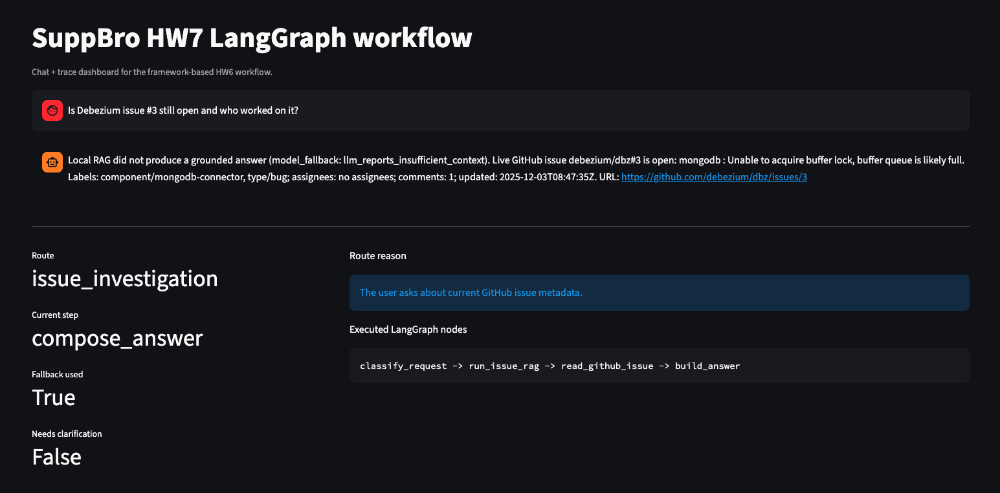
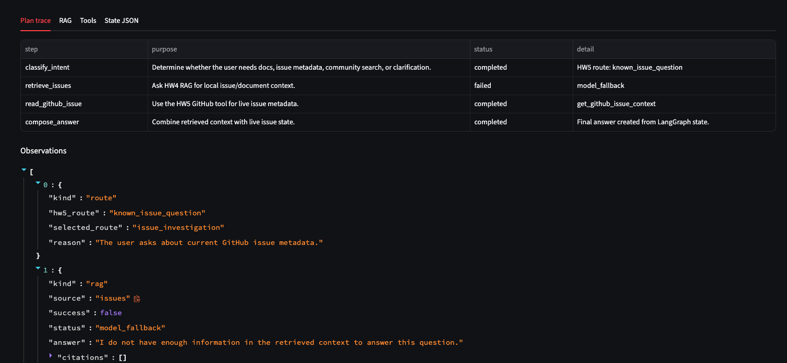
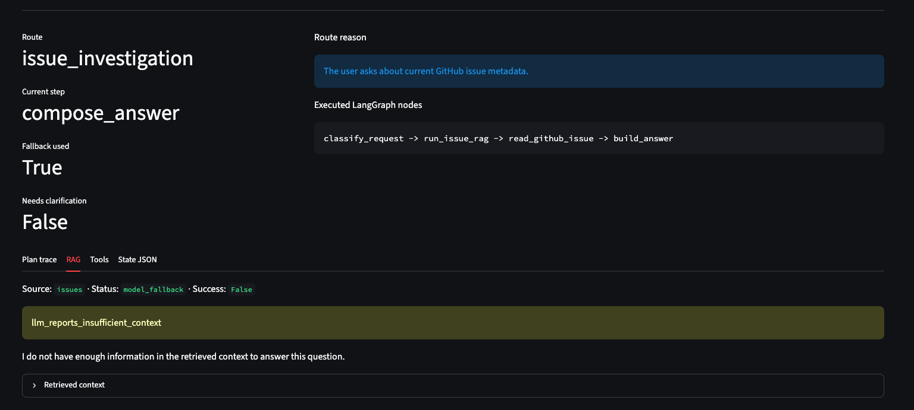
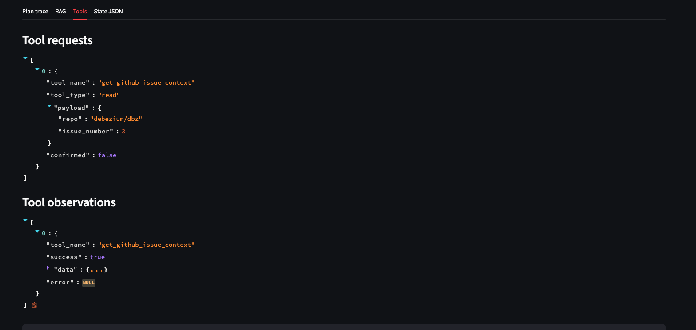
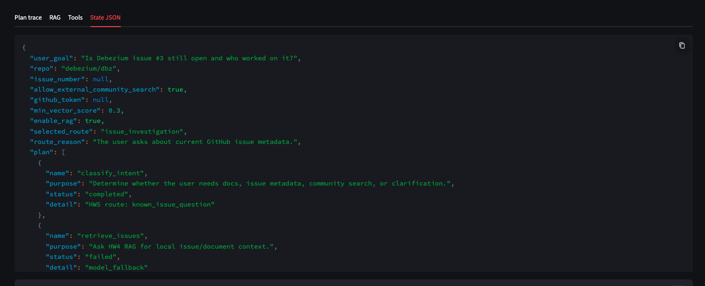

# HW7: LangGraph workflow для SuppBro

У HW7 я переніс custom agentic workflow з HW6 на LangGraph. Логіка бота залишилась та сама: користувач питає про Debezium, агент визначає route, запускає потрібний retrieval або external tool, записує observations у state і формує фінальну відповідь.

LangGraph обраний тому, що він природно описує те, що в HW6 було зроблено вручну: `State`, `Nodes`, `Edges` і conditional routing. Для маленького workflow це трохи більше boilerplate, але структура стає видимою як граф.

## Як запускати

Single question:

```bash
python scripts/hw7/langgraph_flow.py \
  "Is Debezium issue #3 still open and who worked on it?" \
  --issue-number 3 \
  --output-json hw7-langgraph-result.json \
  --output-md hw7-langgraph-summary.md
```

Demo на 5 питаннях:

```bash
python scripts/hw7/langgraph_flow.py \
  --mode demo \
  --output-json hw7-langgraph-result.json \
  --output-md outputs/langgraph_examples.md
```

Якщо треба прогнати без HW4 credentials:

```bash
python scripts/hw7/langgraph_flow.py \
  --mode demo \
  --disable-rag \
  --output-md outputs/langgraph_examples.md
```

Streamlit demo:

```bash
make hw7-streamlit
```

## State

State визначений як `TypedDict` у `scripts/hw7/langgraph_flow.py`.

| Field | Для чого |
|---|---|
| `user_goal` | Початкове питання користувача. |
| `selected_route` | Route після classification: docs, issue, community або clarification. |
| `route_reason` | Чому classifier вибрав цей route. |
| `plan` | Людинозрозумілий plan зі статусами кроків. |
| `executed_nodes` | Реальна послідовність LangGraph nodes. |
| `rag_calls` | HW4 retrieval observations. |
| `tool_calls` | HW5 tool requests. |
| `external_tool_results` | HW5 tool observations. |
| `observations` | Загальна timeline-стрічка route/RAG/tool events. |
| `final_answer` | Відповідь, зібрана з фінального state. |

## Nodes

| Node | Що робить |
|---|---|
| `classify_request` | Викликає HW5 classifier, вибирає route і будує plan. |
| `run_docs_rag` | Запускає HW4 RAG по documentation chunks. |
| `run_issue_rag` | Запускає HW4 RAG по issue chunks. |
| `run_community_rag` | Спочатку перевіряє local issue context перед community lookup. |
| `read_github_issue` | Викликає HW5 GitHub tool для live issue metadata. |
| `search_community` | Викликає HW5 Stack Overflow tool, якщо community search дозволений. |
| `ask_clarification` | Повертає уточнюючі питання замість випадкового retrieval. |
| `build_answer` | Формує фінальну відповідь із LangGraph state. |

## Edges

Після `classify_request` використовується conditional edge:

| Route | Наступний node |
|---|---|
| `docs_answer` | `run_docs_rag` |
| `issue_investigation` | `run_issue_rag` |
| `community_lookup` | `run_community_rag` |
| `clarification` | `ask_clarification` |

Далі workflow завершується через `build_answer`.

```text
classify_request
  -> run_docs_rag -> build_answer
  -> run_issue_rag -> read_github_issue -> build_answer
  -> run_community_rag -> search_community -> build_answer
  -> ask_clarification -> build_answer
```

## Приклади

Файл з результатами demo: `outputs/langgraph_examples.md`.

Demo запускає ті самі 5 питань, які використовувались у HW6:

| # | Тип | Query | Очікуваний route |
|---:|---|---|---|
| 1 | Документаційне питання | `Can I get exactly once delivery?` | `docs_answer` |
| 2 | Known error | `Backpressure error says unable to acquire buffer lock and queue is full` | `issue_investigation` |
| 3 | Точний GitHub issue | `Is Debezium issue #3 still open and who worked on it?` | `issue_investigation` |
| 4 | Community search | `Has anyone seen Debezium unable to acquire buffer lock on Stack Overflow?` | `community_lookup` |
| 5 | Нечітке питання | `Help with Debezium` | `clarification` |

## Результат прогону

Останній demo run: [GitHub Actions run 32473072564](https://github.com/Uhbyxer/supp-bro/actions/runs/32473072564). Artifact із JSON/Markdown trace: [hw7-langgraph-workflow-result](https://github.com/Uhbyxer/supp-bro/actions/runs/32473072564/artifacts/9443343774).

Run пройшов успішно: job `langgraph-workflow` завершився зі статусом `success`, unit tests пройшли, LangGraph demo відпрацював усі 5 питань і завантажив artifact з фінальним state.

| # | Query | Route | Executed nodes | RAG status | Tool | Що відповів бот | Очікувано? | Коментар |
|---:|---|---|---|---|---|---|---|---|
| 1 | `Can I get exactly once delivery?` | `docs_answer` | `classify_request -> run_docs_rag -> build_answer` | `grounded_answer` | `none` | Відповів, що exactly-once delivery можливий через Debezium як source connector у Kafka Connect, але Debezium не має власного internal deduplication layer; додав citations. | Так | Це чисте документаційне питання, тому правильний шлях: тільки RAG по docs без external tool. |
| 2 | `Backpressure error says unable to acquire buffer lock and queue is full` | `issue_investigation` | `classify_request -> run_issue_rag -> read_github_issue -> build_answer` | `grounded_answer` | `get_github_issue_context` | Спочатку дав local RAG пояснення про заповнену buffer queue у MongoDB connector, потім додав live GitHub status для `debezium/dbz#3`: issue open, labels `component/mongodb-connector`, `type/bug`, assignees відсутні. | Так | Це найкращий сценарій для agentic workflow: RAG дає локальне пояснення, а GitHub tool додає актуальний стан issue. |
| 3 | `Is Debezium issue #3 still open and who worked on it?` | `issue_investigation` | `classify_request -> run_issue_rag -> read_github_issue -> build_answer` | `model_fallback` | `get_github_issue_context` | RAG не дав grounded answer, але GitHub tool повернув live status issue #3: open, title, labels, comments, updated date і URL. | Так | Для питання про поточний статус issue fallback у RAG очікуваний: локальна база знань не є джерелом live metadata, тому відповідь правильно будується через GitHub tool. |
| 4 | `Has anyone seen Debezium unable to acquire buffer lock on Stack Overflow?` | `community_lookup` | `classify_request -> run_community_rag -> search_community -> build_answer` | `model_fallback` | `search_stackoverflow_questions` | Відповів, що matching Stack Overflow questions не знайдено, але local RAG observation доступний у trace. | Так | Користувач явно просив community lookup, тому route правильний. Нуль результатів у Stack Overflow тут не помилка, а валідний результат external search. |
| 5 | `Help with Debezium` | `clarification` | `classify_request -> ask_clarification -> build_answer` | `not_called` | `ask_clarifying_question` | Попросив уточнити connector, exact error message і чи шукати в local docs/issues або external community sources. | Так | Нечітке питання не запускає випадковий retrieval. LangGraph route веде до clarification node, що є правильним і безпечним fallback для подальшого розвитку агента. |

Головний висновок: LangGraph не змінив якість відповідей сам по собі, але зробив workflow прозорішим. У trace тепер явно видно, які nodes були виконані для кожного route, а conditional edge після `classify_request` показує, чому питання пішло в docs, issue investigation, community lookup або clarification.

## Streamlit

Streamlit перенесений на HW7 і тепер показує не тільки plan/RAG/tools/state, а й фактичний список `executed_nodes`. Це зручно для демонстрації framework workflow: видно, якими LangGraph nodes пройшло конкретне питання.

Запуск:

```bash
python -m streamlit run scripts/hw7/streamlit_app.py
```

### Streamlit screenshots

Нижче показаний сценарій для питання `Is Debezium issue #3 still open and who worked on it?`. Це корисний приклад саме для HW7, бо видно не тільки відповідь, а й фактичний шлях у LangGraph: `classify_request -> run_issue_rag -> read_github_issue -> build_answer`.

#### Chat, route і executed nodes

На головному екрані видно відповідь бота, route `issue_investigation`, `fallback_used=True` і список виконаних LangGraph nodes. Тут добре видно, що RAG fallback не зупинив workflow: після нього агент перейшов до GitHub tool.



#### Plan trace

Plan trace показує ті самі кроки в більш user-friendly форматі: `classify_intent`, `retrieve_issues`, `read_github_issue`, `compose_answer`. Крок `retrieve_issues` має `model_fallback`, але `read_github_issue` і `compose_answer` завершились успішно.



#### RAG observation

RAG tab пояснює причину fallback: локальний retrieval/model не мав достатньо grounded context, щоб відповісти на питання про live status issue. Для такого запиту це очікувано, бо актуальні metadata краще брати через GitHub API.



#### External tool call

Tools tab показує HW5 tool request `get_github_issue_context` для `debezium/dbz#3` і успішний tool observation. Саме цей node компенсує обмеження локального RAG.



#### Final state

State JSON показує весь LangGraph state після виконання: початкове питання, route, plan statuses, RAG/tool observations, `executed_nodes`, `fallback_used` і фінальну відповідь.



## Custom HW6 vs LangGraph HW7

| Аспект | Custom HW6 | LangGraph HW7 |
|---|---|---|
| Структура workflow | Послідовність кроків описана вручну через `if/else`. | Nodes і edges явно описані в graph definition. |
| State | Dataclass, який ми самі передаємо і змінюємо. | `TypedDict`, який проходить через LangGraph nodes. |
| Conditional routing | Звичайна умова в Python-коді. | Explicit conditional edge після `classify_request`. |
| Debug/demo | Треба читати custom trace fields. | Окремо видно `executed_nodes`, тобто реальний шлях у графі. |
| Складність | Менше boilerplate для малого workflow. | Більше коду, але краще масштабується для нових routes/nodes. |

Висновок: для HW6 custom implementation був достатній, бо workflow невеликий. Для HW7 LangGraph корисний тим, що робить route branching явним і краще підходить для наступного розвитку SuppBro: додавання нових tools, окремого review node, retry/fallback paths або людського clarification step.
